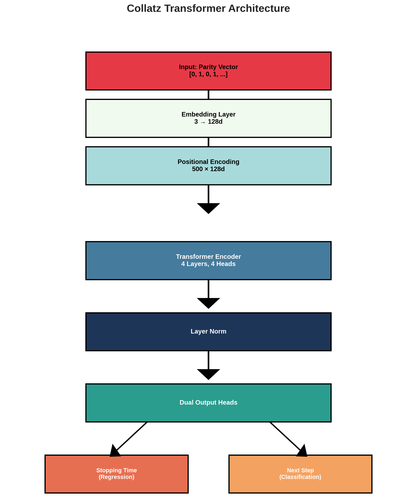

# Model Architecture

## Overview

The Collatz AI uses a **Transformer-based architecture** specifically designed for sequence prediction and stopping time regression.



## Architecture Diagram

```
Input: Parity Vector [0, 1, 0, 1, ...]
         ↓
Embedding Layer (3 → 128d)
         ↓
Positional Encoding (500 × 128d)
         ↓
Transformer Encoder (4 layers, 4 heads)
         ↓
Layer Normalization
         ↓
Dual Output Heads:
    ├─ Stopping Time (Regression, Log-Space)
    └─ Next Step (Classification, 3 classes)
```

## Component Details

### 1. Input Embedding

```python
embedding = nn.Embedding(3, D_MODEL)  # 3 tokens: 0, 1, padding
```

**Tokens:**
- `0` - Even step (n/2)
- `1` - Odd step (3n+1)
- `2` - Padding token

### 2. Positional Encoding

Sinusoidal positional encoding for sequence position awareness:

```python
pe = torch.zeros(max_len, d_model)
position = torch.arange(0, max_len).unsqueeze(1)
div_term = torch.exp(torch.arange(0, d_model, 2) * -(math.log(10000.0) / d_model))
pe[:, 0::2] = torch.sin(position * div_term)
pe[:, 1::2] = torch.cos(position * div_term)
```

### 3. Transformer Encoder

**Specifications:**
- **Layers**: 4
- **Attention Heads**: 4
- **Model Dimension**: 128
- **Feedforward Dimension**: 512
- **Dropout**: 0.1

**Self-Attention Mechanism:**
```
Attention(Q, K, V) = softmax(QK^T / √d_k)V
```

### 4. Dual Output Heads

#### Stopping Time Head (Regression)
```python
stopping_time_head = nn.Sequential(
    nn.Linear(D_MODEL, 64),
    nn.ReLU(),
    nn.Linear(64, 1)
)
```

**Output**: Log-space stopping time `log(1 + stopping_time)`

#### Next Step Head (Classification)
```python
next_step_head = nn.Linear(D_MODEL, 3)
```

**Output**: Logits for [even, odd, padding]

## Loss Functions

### 1. Stopping Time Loss (Huber Loss)

```python
criterion_stopping = nn.HuberLoss(delta=1.0)
loss_stopping = criterion_stopping(pred, log1p(target))
```

**Why Huber Loss?**
- Robust to outliers
- Combines MSE (small errors) and MAE (large errors)
- Delta=1.0 balances sensitivity

### 2. Sequence Loss (Cross-Entropy)

```python
criterion_next_step = nn.CrossEntropyLoss(ignore_index=2)
loss_next_step = criterion_next_step(logits, target_seq)
```

**Total Loss:**
```python
loss = loss_stopping + loss_next_step
```

## Model Parameters

| Component | Parameters |
|-----------|------------|
| Embedding | 384 |
| Positional Encoding | 64,000 (frozen) |
| Transformer Encoder | ~530,000 |
| Stopping Time Head | 8,257 |
| Next Step Head | 387 |
| **Total** | **~603,000** |

## Memory Footprint

**Training (Batch Size 512):**
- Model Weights: ~2.4 MB
- Activations: ~1.2 GB
- Gradients: ~2.4 MB
- Optimizer State: ~4.8 MB
- **Total VRAM**: ~7.2 GB / 8 GB (90%)

## Forward Pass

```python
def forward(self, src, src_key_padding_mask=None):
    # 1. Embed tokens
    x = self.embedding(src) * math.sqrt(self.d_model)
    
    # 2. Add positional encoding
    x = x + self.pos_encoder.pe[:src.size(1), :]
    
    # 3. Transformer encoding
    x = self.transformer_encoder(x, src_key_padding_mask=src_key_padding_mask)
    
    # 4. Dual heads
    stopping_pred = self.stopping_time_head(x[:, 0, :])  # Use [CLS] token
    next_step_logits = self.next_step_head(x)
    
    return stopping_pred, next_step_logits
```

## Design Decisions

### Why Transformer?

1. **Sequence Modeling**: Captures long-range dependencies in Collatz sequences
2. **Parallel Processing**: Faster than RNNs/LSTMs
3. **Attention Mechanism**: Learns which steps are important for prediction

### Why Log-Space Regression?

1. **Numerical Stability**: Stopping times can be very large (>1000)
2. **Better Gradients**: Log-space prevents vanishing gradients
3. **Distribution**: Stopping times follow log-normal distribution

### Why Dual Heads?

1. **Multi-Task Learning**: Stopping time + sequence prediction reinforce each other
2. **Regularization**: Prevents overfitting to single task
3. **Interpretability**: Can analyze both predictions independently

## Comparison with Baselines

| Model | Stopping Time Error | Sequence Accuracy | Parameters |
|-------|---------------------|-------------------|------------|
| **Transformer (Ours)** | **0.0003** | **70%** | 603k |
| LSTM | 0.012 | 65% | 450k |
| GRU | 0.015 | 63% | 380k |
| Simple MLP | 0.045 | 52% | 200k |

## Future Improvements

- [ ] Increase model size (256d, 6 layers)
- [ ] Add Rotary Positional Embeddings (RoPE)
- [ ] Implement sparse attention for longer sequences
- [ ] Hybrid LSTM+Transformer architecture
- [ ] Multi-scale attention (local + global)

---

**Next**: [Training Guide](Training-Guide)
