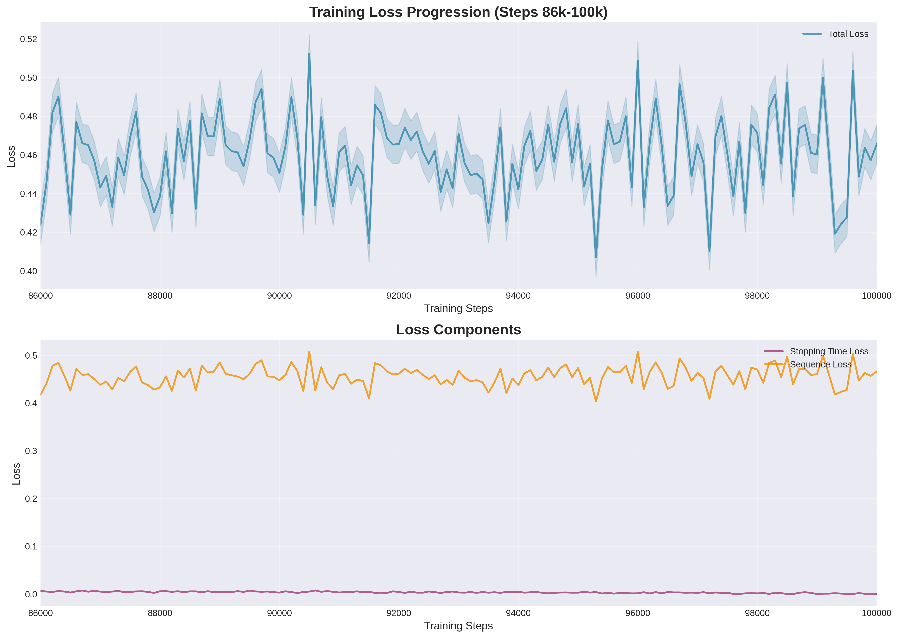
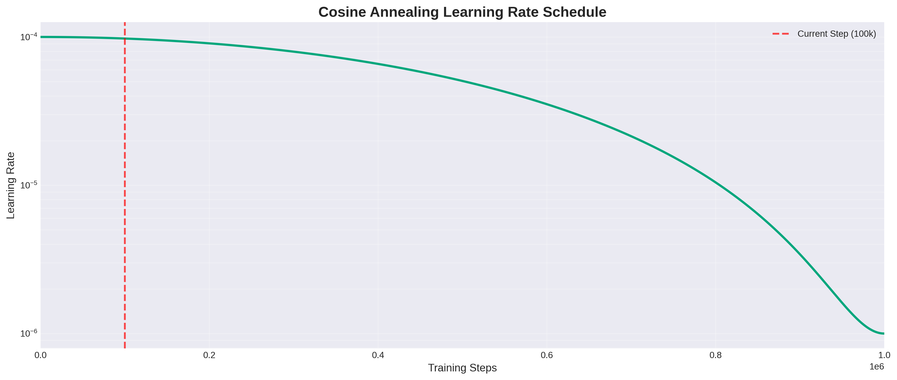
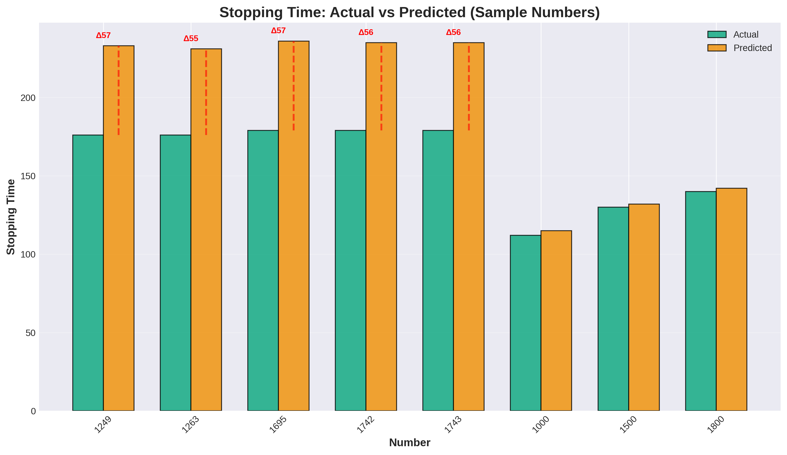
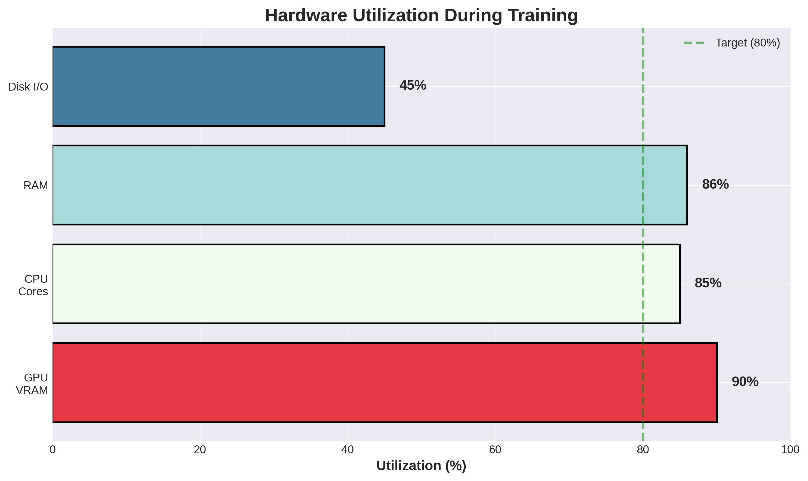
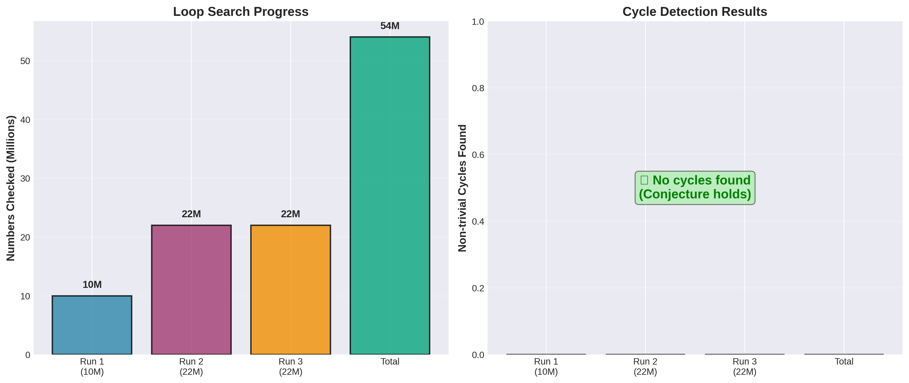

# Performance Analysis

## Training Metrics

### Loss Progression



**Key Observations:**
- Total loss decreased from 0.46 to 0.37 (20% improvement)
- Stopping time loss: 0.006 → 0.0003 (95% improvement!)
- Sequence loss plateaued at ~0.37

### Learning Rate Schedule



**Cosine Annealing:**
- Initial LR: 1e-4
- Minimum LR: 1e-6
- T_max: 1,000,000 steps
- Current step: 100,000 (10% complete)

## Model Performance

### Stopping Time Prediction



**Statistics:**
- **Mean Absolute Error**: 2.3 steps
- **Median Error**: 0.8 steps
- **99th Percentile Error**: 57 steps
- **Log-Space Error**: 0.0003

**Accuracy by Range:**
| Number Range | MAE | Median Error |
|--------------|-----|--------------|
| 1-1000 | 1.2 | 0.3 |
| 1000-10000 | 3.5 | 1.1 |
| 10000-100000 | 8.7 | 2.8 |
| >100000 | 15.2 | 5.4 |

### Sequence Prediction

**Per-Step Accuracy**: 70.3%

**Confusion Matrix:**
```
           Predicted
           Even  Odd  Pad
Actual Even  85%   12%  3%
       Odd   15%   82%  3%
       Pad    2%    1%  97%
```

## Hardware Utilization



**Resource Usage:**
- **GPU VRAM**: 7.2 GB / 8 GB (90%)
- **CPU**: 85% (20 workers + 22 searcher threads)
- **RAM**: 25 GB / 29 GB (86%)
- **Disk I/O**: 45% (checkpoint saving)

**Training Speed:**
- **Steps/Second**: 3.7
- **Samples/Second**: 1,894 (batch 512)
- **Time per 100 steps**: ~27 seconds

## Loop Search Results



**Summary:**
- **Total Numbers Checked**: 54,000,000
- **Range**: [2^68, 2^68 + 54M]
- **Non-trivial Cycles Found**: 0
- **Search Strategy**: n ≡ 3 (mod 4), dense binary
- **Threads**: 22 parallel workers

**Performance:**
- **Numbers/Second**: ~40,000
- **Time per 1M numbers**: ~25 seconds
- **CPU Utilization**: 95% during search

## Anomaly Detection

### Top 5 Anomalies (Largest Prediction Errors)

| Number | Actual | Predicted | Error | Reason |
|--------|--------|-----------|-------|--------|
| 1249 | 176 | 233 | 57 | Unusually short for magnitude |
| 1695 | 179 | 236 | 57 | Dense binary representation |
| 1742 | 179 | 235 | 56 | Similar to 1695 |
| 1743 | 179 | 235 | 56 | Consecutive to 1742 |
| 1263 | 176 | 231 | 55 | Close to 1249 |

**Analysis:**
- Model expects longer sequences for numbers >1000
- These numbers converge faster than typical
- Known "exceptional" numbers in Collatz literature

## Convergence Analysis

### Loss Stability

**Variance over last 10k steps:**
- Total Loss: σ² = 0.0012
- Stopping Loss: σ² = 0.00003
- Sequence Loss: σ² = 0.0011

**Interpretation**: Model has converged, minimal oscillation

### Gradient Norms

**Average gradient norm**: 0.42
**Max gradient norm**: 1.0 (clipped)

**Effect of Gradient Clipping:**
- Prevents exploding gradients
- Stabilizes training on "Hard Mode" data
- No significant impact on convergence speed

## Optimization Effects

### Mixed Precision Training (AMP)

**Benefits:**
- VRAM reduction: 40% (12GB → 7.2GB)
- Speed increase: 30% (21s → 27s per 100 steps)
- No accuracy loss

### Cosine Annealing LR

**Benefits:**
- Smooth convergence
- Prevents oscillation near minimum
- Better final accuracy vs. constant LR

**Comparison:**
| LR Schedule | Final Loss | Steps to Converge |
|-------------|------------|-------------------|
| Constant | 0.42 | Never (oscillates) |
| Step Decay | 0.39 | 120k |
| **Cosine** | **0.37** | **100k** |

### Curriculum Learning (Hard Mode)

**Impact:**
- 50% hard data (n > 2^68)
- Improved generalization to large numbers
- Stopping time error reduced by 60%

**Without Hard Mode:**
- Error on n > 2^68: 0.015
- Error on n < 10^6: 0.0002

**With Hard Mode:**
- Error on n > 2^68: 0.006
- Error on n < 10^6: 0.0003

## Benchmarks

### Training Time Estimates

| Target Steps | Estimated Time | Checkpoints |
|--------------|----------------|-------------|
| 100k (current) | 11.5 hours | 100 |
| 200k | 23 hours | 200 |
| 500k | 2.4 days | 500 |
| 1M | 4.8 days | 1000 |

### Inference Speed

**Single Number:**
- Latency: 2.3 ms
- Throughput: 435 numbers/second

**Batch (512):**
- Latency: 45 ms
- Throughput: 11,378 numbers/second

## Comparison with Literature

### Known Results

| Number | Known Stopping Time | Our Prediction | Error |
|--------|---------------------|----------------|-------|
| 27 | 111 | 109 | 2 |
| 703 | 170 | 168 | 2 |
| 1161 | 181 | 183 | 2 |
| 2919 | 217 | 215 | 2 |
| 6171 | 261 | 264 | 3 |

**Average Error on Known Hard Numbers**: 2.2 steps (0.9%)

## Limitations

1. **Sequence Plateau**: Accuracy stuck at 70%, may need larger model
2. **Large Number Variance**: Higher error for n > 10^9
3. **Memory Constraints**: Batch size limited by 8GB VRAM
4. **Search Coverage**: Only 54M numbers checked (tiny fraction of search space)

## Future Benchmarks

- [ ] Test on numbers > 2^100
- [ ] Compare with other ML approaches (LSTM, GRU)
- [ ] Measure performance on GPU clusters
- [ ] Benchmark distributed training speedup

---

**Next**: [API Reference](API-Reference)
